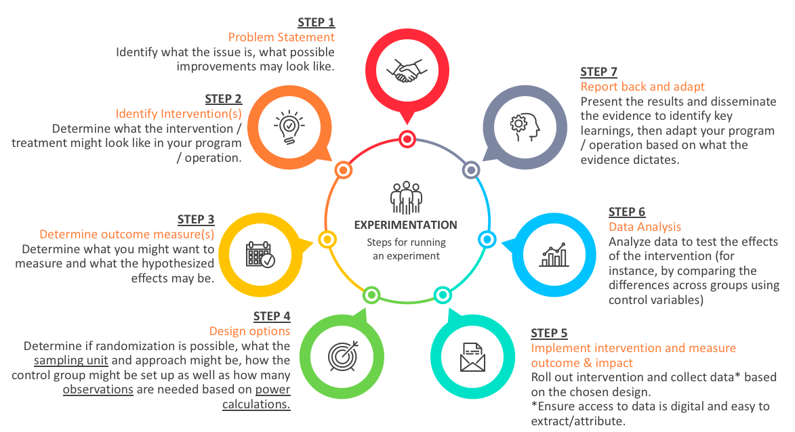

# Experiment components

## Experiment basics

An experiment is the foundation of the scientific method, which is a systematic means of exploring the world around us. Although some experiments take place in laboratories, we could perform an experiment anywhere, at any time.

When we say the _scientific method_, we really mean the following steps: 
- Making observations.
- Formulating a hypothesis.
- Designing and conducting an experiment to test the hypothesis.
- Evaluating the results of the experiment.
- Accepting or rejecting the hypothesis.
- If necessary, making and testing a new hypothesis.

Variables are also a key part of an experiment. A _variable_ is anything you can change or control in an experiment. Some examples of variables include engagement, duration of the experiment, composition of the study population, behaviours, etc. There are three kinds of variables in an experiment: controlled variables, independent variables and dependent variables.

**Independent variable:** is the one factor that you are changing. It is one factor because usually in an experiment you try to change one thing at a time. This makes measurements and interpretation of the data much easier. If you are trying to determine whether heating milk allows you to dissolve more sugar in the coffee then your independent variable is the temperature of the milk. This is the variable you are purposely controlling.

**Dependent variable:** is the variable you observe, to see whether it is affected by your independent variable. In the example where you are heating milk to see if this affects the amount of sugar you can dissolve, the mass or volume of sugar (whichever you choose to measure) would be your dependent variable.

**Controlled variables:** sometimes called constant variables are variables that are kept constant or unchanging. For example, in an experiment looking at the effects of studying on test scores, studying would be the independent variable and test scores will be dependent variable. Since in the example, we are trying to determine if changes to the independent variable (studying) result in significant changes to the dependent variable (the test results), we may want to keep the test constant or administer the experiment to the students in the same class who are within the same age group and perhaps have the same teachers. Control variables help us reduce the confounding biases in experiments.

It is also important to be aware that there may be other variables that might influence the results of an experiment. There is another kind of variables that might influence the outcome called the extraneous variable. Extraneous variables are variables that might affect the relationships between the independent variable and the dependent variable; experimenters usually try to identify and control for these variables. For instance, they can include demand characteristics (which are clues about how the participants should respond) and experimenter effects (which is when the researchers accidentally provide clues about how a participant will respond). When an extraneous variable cannot be controlled for in an experiment, it is known as a confounding variable. 

The main steps in running an experiment is depicted in the following figure:

