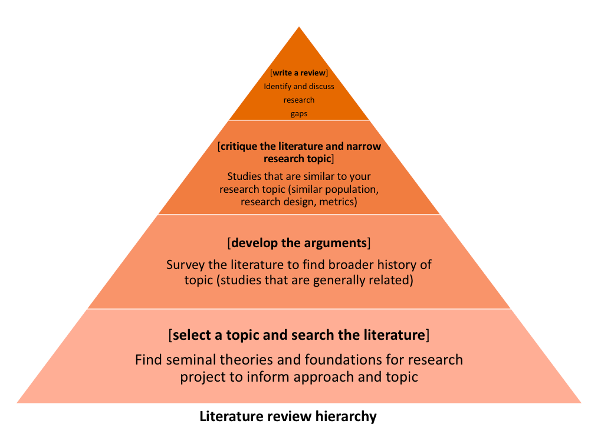

# Defining the problem

## What is a review of the literature?
A literature review is an account of what has been published on a topic by accredited scholars and researchers. Occasionally you will be asked to write one as a separate assignment (sometimes in the form of an annotated bibliography—see the bottom of the next page), but more often it is part of the introduction to an essay, research report, or thesis. In writing the literature review, your purpose is to convey to your reader what knowledge and ideas have been established on a topic, and what their strengths and weaknesses are. As a piece of writing, the literature review must be defined by a guiding concept (e.g., your research objective, the problem or issue you are discussing, or your argumentative thesis). It is not just a descriptive list of the material available, or a set of summaries

Besides enlarging your knowledge about the topic, writing a literature review lets you gain and demonstrate skills in two areas

information seeking: the ability to scan the literature efficiently, using manual or computerized methods, to identify a set of useful articles and books
critical appraisal: the ability to apply principles of analysis to identify unbiased and valid studies.
A literature review must do these things

be organized around and related directly to the thesis or research question you are developing
synthesize results into a summary of what is and is not known
identify areas of controversy in the literature
formulate questions that need further research

## Ask yourself questions like these:
What is the specific thesis, problem, or research question that my literature review helps to define?
What type of literature review am I conducting? Am I looking at issues of theory? methodology? policy? quantitative research (e.g. on the effectiveness of a new procedure)? qualitative research (e.g., studies of loneliness among migrant workers)?
What is the scope of my literature review? What types of publications am I using (e.g., journals, books, government documents, popular media)? What discipline am I working in (e.g., nursing psychology, sociology, medicine)?
How good was my information seeking? Has my search been wide enough to ensure I’ve found all the relevant material? Has it been narrow enough to exclude irrelevant material? Is the number of sources I’ve used appropriate for the length of my paper?
Have I critically analysed the literature I use? Do I follow through a set of concepts and questions, comparing items to each other in the ways they deal with them? Instead of just listing and summarizing items, do I assess them, discussing strengths and weaknesses?
Have I cited and discussed studies contrary to my perspective?
Will the reader find my literature review relevant, appropriate, and useful?

## Ask yourself questions like these about each book or article you include:
Has the author formulated a problem/issue?
Is it clearly defined? Is its significance (scope, severity, relevance) clearly established?
Could the problem have been approached more effectively from another perspective?
What is the author’s research orientation (e.g., interpretive, critical science, combination)?
What is the author’s theoretical framework (e.g., psychological, developmental, feminist)?
What is the relationship between the theoretical and research perspectives?
Has the author evaluated the literature relevant to the problem/issue? Does the author include literature taking positions she or he does not agree with?
In a research study, how good are the basic components of the study design (e.g., population, intervention, outcome)? How accurate and valid are the measurements? Is the analysis of the data accurate and relevant to the research question? Are the conclusions validly based upon the data and analysis?
In material written for a popular readership, does the author use appeals to emotion, one-sided examples, or rhetorically-charged language and tone? Is there an objective basis to the reasoning, or is the author merely “proving” what he or she already believes?
How does the author structure the argument? Can you “deconstruct” the flow of the argument to see whether or where it breaks down logically (e.g., in establishing cause-effect relationships)?
In what ways does this book or article contribute to our understanding of the problem under study, and in what ways is it useful for practice? What are the strengths and limitations?
How does this book or article relate to the specific thesis or question I am developing?

## Final Notes:
A literature review is a piece of discursive prose, not a list describing or summarizing one piece of literature after another. It’s usually a bad sign to see every paragraph beginning with the name of a researcher. Instead, organize the literature review into sections that present themes or identify trends, including relevant theory. You are not trying to list all the material published, but to synthesize and evaluate it according to the guiding concept of your thesis or research question

If you are writing an annotated bibliography, you may need to summarize each item briefly, but should still follow through themes and concepts and do some critical assessment of material. Use an overall introduction and conclusion to state the scope of your coverage and to formulate the question, problem, or concept your chosen material illuminates. Usually you will have the option of grouping items into sections—this helps you indicate comparisons and relationships. You may be able to write a paragraph or so to introduce the focus of each section