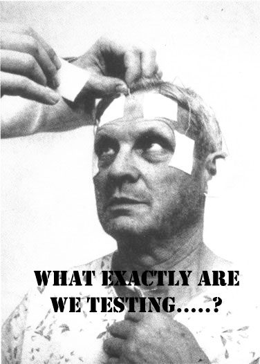
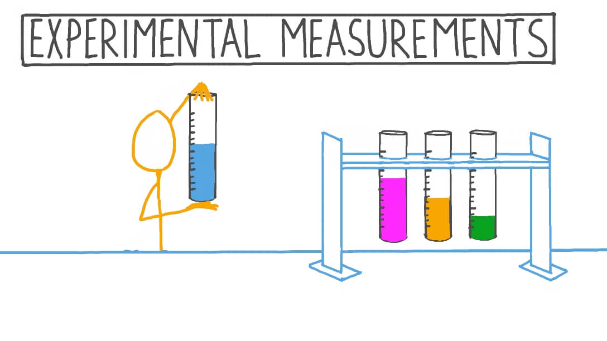
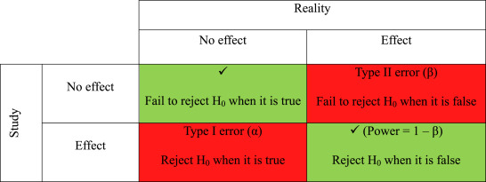

# Defining the problem

## The problem statement
>  Experimentation as a problem-solving process carried out under controlled conditions in order to discover an unknown effect or law, to test or establish a hypothesis, or to illustrate a known law

Experimentation is described as many things: a method, an approach, a test, or a tool to generate evidence. All of this is true, but experimentation is first and foremost a problem-solving process. 

The starting point for your experiment should not be the methodology, nor a predetermined answer; it should be the problem you are trying to resolve. 

To help us chose the problem statement, we can go through the following steps:

**Step 1: Choose a topic**
1. What do I find interesting about the subject? 
2. What is known about the subject? 
3. What is missing and what are the gaps?

In theory, the topic could be in any field (for instance, agriculture, but also fiscal policy) and at any level (for instance, it could affect 20 people, or it could reach most of Canada’s population). It could touch upon the realm of policy, program, service delivery, regulatory and internal services. 

The problem doesn’t always need to be causal in nature, in which case perhaps an observational study is better.

**Step 2: Narrow the topic**
1. What do you need to know more about on the topic? 
2. Are you interested in social, political, economic, gender, religious issues related to your topic?
- Find a "slant" on your topic and determine the root causes (physical, social, or organizational causes)
- Develop possible solutions and select a solution
3. Will the results reveal something new or unexpected?
4. What is in scope and what is out of scope?
5. Can you clearly define hypotheses (If…then…) and explicitly state research questions?

The problem statement you develop should be clear and precise, but also scoped into a relevant policy area that is within your reach (in terms of jurisdiction, for instance). A problem that has too little impact to be deemed important is likely not a great fit, nor is a problem with little decision-making implications very useful to be explored. Similarly,  problem statements that are too vague need to be modified so that they’re scoped appropriately. 

For instance, a paper looks at framing effects in healthcare and asks whether patients preference for a therapy change by having positive contextual information? (a specific and clear problem statement)
In this case, they tell a group of patients that that **90%** of those who have a certain operation are alive after five years. These patients are more likely to chose the operation than when they are told that after five years, **10%** of patients are dead (McNeil et al. (1982), On the elicitation of preferences for alternative therapies, New England Journal of Medicine).

**Step 3: Find Resources**
1. How do we design a research proposal that builds on existing knowledge to address critical questions? 
2. The key here is getting to know what is already done on the topic and how can our design improve or build on current knowledge. 
3. Perform a systematic literature search by using the keywords you have compiled and use them to search for books in Library Catalogs, blogs, or articles in online databases 
4. Consult with experts and seek feedback 

In a government context, the right scale and scope of the experiment will be dictated by what decision-makers need to know coupled with the various practical constraints that inevitably come along through the design process. 

In general, this step will help us make the proposal more mutually exclusive and collectively exhaustive, **MECE**. By the end of this process, more so than before, we will be able to make statements that do not overlap in content and fully describe the problem at the highest level.

**Step 4: Seek collaboration**
1. Make sure the question is one that other people can get behind and support
2. Establish collaboration agreements and executive buy-in
3. Peer-review for clarity, scientific accuracy, and feasibility
4. Does the team have the expertise required to complete the project? If not, who else needs to be on team?

Figuring out the problem will take time, and needs to be done in consultation with as many parties directly or indirectly potentially impacted by the experiment’s results. Before starting the problem definition stage, you should take time to discuss alongside colleagues, management and others (experts and practitioners, current users) what exactly you wish you fix.

Each of the steps above should be completed before moving on to the next one. However, steps can be repeated. For example, if you’re on the third step, you can still return to the previous step, and redefine the problem. 

## Determine interventions

It’s important to be clear what the different experimental designs can and can’t tell us. What sets observational studies apart from experimental studies is that there is a component of **intervention** in experimentation. 

Fore instance, a group looked at encouraging healthier eating in school lunchrooms through strategic placement of certain foods (interventions). One of two lunch lines was arranged so as to display healthier foods. In the healthier line, sales of healthier food increased by 18% and grams of less healthy food consumed decreased by 28% (Hanks et al. (2012), Healthy Convenience:Nudging Students Toward Healthier Choices in the Lunchroom, Journal of Public Health.)

Another group did something similar and found other interventions like making the food harder to reach or changing the serving utensil at a salad bar from a spoon to tongs reduced intake of unhealthy food by 8-16% (Rozin et al. (2011), Nudge to nobesity I: Minor changes in accessibility decrease food intake, Judgment and Decision Making). 

Only certain experimental designs are helpful for learning about impact and effectiveness of an intervention. Therefore, we need to select a design that best tells us whether or not our new idea is really making a difference. This approximates a controlled experiment of basic science.
When setting up an experimental design, we need to think about what the intervention (treatment) might look like in our program/ operation. It is helpful to think of interventions as steps that help us evaluate the direct impacts of treatment or preventive measures on a situation.  

When thinking about interventions, it is helpful to consider the two following points: 

**Deciding what to measure**: using a government contractor example, consider what kind of data you’d need to answer your key question. In this case, you’d need to know the number and cost of current staff and the percentage of time they spend on necessary business functions. In answering this question, you likely need to answer many sub-questions (e.g., Are staff currently under-utilized? If so, what process improvements would help?). Finally, in your decision on what to measure, be sure to include any reasonable objections any stakeholders might have (e.g., If staff are reduced, how would the company respond to surges in demand?).

**Deciding how to measure it**: thinking about how you measure your data is just as important, especially before the data collection phase, because your measuring process either backs up or discredits your analysis later on. Key questions to ask for this step include:
- What is your time frame? (e.g., annual versus quarterly costs)
- What is your unit of measure? (e.g., USD versus Euro)
- What factors should be included? (e.g., just annual salary versus annual salary plus cost of staff benefits)

## Determine outcomes 

When designing the intervention, it is also important to determine what you want to measure and what the hypothesized effects might be. This will illuminate what data we need to collect, set targets, and develop counter-measures. As part of this, we would want to identify the techniques we will need to perform the measurements and use the collected data for analysis. 

An outcome measure, endpoint, effect measure or measure of effect is a measure which is used to assess the effect, both positive and negative, of an intervention or treatment. Measures can often be quantified using effect sizes. They can also be thought of as providing a score, an interpretation of results or at times a risk categorization of study groups. Prior to providing any intervention, an outcome measure provides baseline data on variable.

Also of note is that experimental studies are usually randomized, meaning the subjects are grouped by chance and we study what happens to people in each group (treatment and control). Any difference in outcomes can then be linked to the intervention.

For instance, an old and reasonably famous paper studied the intervention of priming in a wine shop. By playing French or German music in the background, sales of French and German wine seemed to be significantly affected (North (1997), Instore Music Affects Product Choice, Nature). In this case, the intervention is applied randomly to one group of customers and not to another.

For instance, a well designed randomized control trial (RCT) provides a strong evidence that a given intervention can postulate effectiveness or safety. A RCT is best used when we need to draw conclusions on causality. 

An example is when General Electric wanted its employees to stop smoking. A team ran a RCT where the treatment group received cash incentives to quit. The control group received no incentives.
Quitting for 6 months earned you $250, and quitting for 12 months $400. The treatment group had 3 times the success rate of the control, an effect which persisted even after financial incentives were
discontinued after 12 months (Volpp et al. (2009), A randomized, controlled trial of financial incentives for smoking cessation, New England Journal of Medicine).

There are other experimental designs that will be discussed in Module 3.

> It helps to think of outcome measures through visualization of outcomes / prototypes

As well as increasing our understanding of what experimental design to use when, there is scope for experimenters to get much better at using different tools in combination to innovate more effectively. Prototypers, for instance, could use low-cost randomized trials like A/B tests or nimble trials to evaluate prototyped products or services.

Prototyping emphasizes front-loading risk and creating a solution with a better chance of success through stakeholder engagement. Using plastic Lego bricks to build prototypes of engineering products is a low-fi, low-resource way of making early operational or design issues obvious. But it won’t tell you whether or not the new system works in real life, or at scale.

When designing prototypes, we should think of implementing an intervention to measure the outcomes. For this, we need an independent variable or the factor that is manipulated, changed, or intervened. This is usually a variable that is placed on x-axis when grouping. We also need a dependent variable or the factor that is being measured and usually placed on y-axis during grouping and visualization. 

For instance, a group examined the average donations received when participants (n=159) were presented with an identifiable victim (a girl named Rokia) versus a dry statistical overview of the
problem. The greatest amount of donations were elicited by Rokia alone, even more so than a combination of statistics and a picture of Rokia (Small et al. (2007), Sympathy and callousness: The impact of
deliberative thought on donations to identifiable and statistical victims, Organizational Behavior and Human Decision Processes). 
In this case, the outcome being measured here is 'donations'. One group is exposed to Rokia, one to statistics, and the other to both Rokia and statistics. We can consider all three as explanatory or independent variables (x-axis) and the donation received as dependant on them (y-axis).

## Experimental design(s) 

The following concepts are going to be explained in more detail in Module 5. Here we only provide a brief description of the topics to consider when considering to start an experiment and managing an experimental project. The main takeaway, we hope, is to consider the expertise needed on an experimentation team. 

These concepts help when we are determining whether randomization is possible, what the sampling unit and approach might be, how the control group might be set up as well as how many observations are needed based on power calculations.

Randomized experiments, or quasi-experimental designs, sometimes couched in deadly technical language, are uniquely valuable. Despite their unfashionable status among some policy wonks and evaluators, we will also highlight the value and utility of Quasi-Experimental designs in the next module. Other approaches may be also be suited to finding out different things, at different stages of developing a policy solution.

Regardless of what type of experiment we chose to do, it is helpful to think about the following variables: 

- A control group is a group of ‘test’ items in an experiment. The control group will be used to compare with the experimental group
- The control group doesn’t get the treatment 
- An experimental group is the group(s) of test items where only one change (called the experimental or independent variable) has been made
- The experimental group gets the treatment
- The experimental group may have dependent or independent variables

In the case when a real control group is not available, a synthetic control group or a more inventive statistical methods may be useful.

For instance, a Behavioural Insights team worked with Home Retail Group (50,000 staff & 1,079 stores in the U.K.) and Charities Trust to raise charitable giving through a payroll giving scheme. They have an
automatic escalation program called Xtra Factor which increases donations by 3% per year. However, only 10% of new donors were taking it up.
By changing the default for the Xtra Factor to opt-out for new donors,the proportion of new
donors using it jumped from 6% to 49% (Behavioural Insights Team (2013), Applying behavioural insights to charitable giving).

In another example, a team looked at the effects of reducing plate size and providing social cues on food consumption on food waste in hotel restaurants. An example of the latter is a salient sign saying “Welcome back! Again! And again! Visit our buffet many times. That’s better than taking a lot once”. Both treatments proved to be effective at changing eating behavior, reducing food waste by 20% (Kalbekken (2011), 'Nudging' hotel guests to reduce food waste as a win–win, environmental measure, Economics Letters). 

It is also in this step that we determine what information we want to collect, set a timeframe for data collection, and determine the data collection methods.

**Source of error considerations**
- Mind the constants: the conditions that are kept the same for control and experimental groups
- Not controlling for factors or parameters that are kept the same in both control and experimental groups can result in error
- Type I error (α) is the rejection of a true null hypothesis (_"false positive"_ finding or conclusion, e.g.  "an innocent person is convicted") or finding a difference when a difference does not exist
- Type II error (β) is the non-rejection of a false null hypothesis (_"false negative"_ finding or conclusion, e.g. a guilty person isn't convicted) or not detecting a difference when one actually exists

**Sample size considerations**
Sample size measures the number of individual samples measured or observations used in a survey or experiment. For example, if you test 100 people for COVID, your sample size is 100. 

In general, we want to: 
- Maximize sample size (n): the larger the number of test items the more accurate the estimate
- Use representative groups: the samples must reflect the natural variation in the population. 
- Use random or systematic sampling to reduce inherent bias in data.

For sample size calculations, we need a hypothesis test, a significance level for the test, the smallest effect size (∆) that is of scientific interest, and the intended power (power = 1 – β) of the test. 

There are often softwares that help statisticians decide what sample size and power to chose for a set of sample observations. In general:
- The price of increased power is that as standard deviation goes up, so does the probability of a Type I error because 
- As sample size increases, so does the power of the significance test. This is because a larger sample size narrows the distribution of the test statistic

Statistical power is a measure of the likelihood that a researcher will find statistical significance in a sample if the effect exists in the full population. Power is a function of three primary factors: sample size, effect size, significance level.

## Collect and Analyze data 

At this point, we have a problem, and intervention, a research plan, and data collection strategies. Therefore, we are ready to start implementing the experimental design to collect the data and then analyze it.

We can treat data as qualitative (descriptive) or quantitative (quantitative values/ numbers). Before you collect new data, determine what information could be collected from existing databases or sources on hand. Collect this data first. Also determine a file storing and naming system ahead of time to help all tasked team members collaborate. This process saves time and prevents team members from collecting the same information twice. If you need to gather data via observation or interviews, then develop an interview template ahead of time to ensure consistency and save time. Keep your collected data organized in a log with collection dates and add any source notes as you go (including any data normalization performed). This practice validates your conclusions down the road.

**Quantitative data** comes in the form of numbers, quantities and values and describes things in concrete and easily measurable terms. Examples include the number of students who applied to a grant, the rating a customer gave a product out of five stars and the number of times a visitor spent on the website.

**Qualitative data** is descriptive, rather than numeric. It is less concrete and less easily measurable than quantitative data. This data may contain descriptive phrases and opinions. Examples include an open ended review a customer writes about a product, an answer to an survey question about what type of applications a customer likes to fill and the conversation an applicant has with a service representative.

Regardless of what kind of data we collect, a  proactive data management strategy will make storage, retrieval, and analysis easier. 

The analysis phase is also as crucial because it turns raw data into valuable insights that we can use to enhance strategies, products and business decisions. We can often couple data analytics tools to raw data (e.g. power BI softwares, etc) to help with analysis. Visio, Nvivo, Minitab, Stata, and Microsoft Excel are other great tools and software packages for advanced statistical data analysis. The goal of analysis of the data to really to test the effects of the intervention we wanted to measure (e.g. comparing the differences between groups who got a treatment and those who didn't).

Devote some time to review the results. What happened after you implemented the interventions? What worked, what didn’t, and what did your solution improve? Analyze if your actions made the required impact and if you addressed the root causes of the issue. It’s also time to look for improvements in the solution and to plan ongoing monitoring. You can also analyze what you’ve learned and what still needs to be learned when it comes to problem-solving processes and skills. 

As you interpret the results, ask yourself these key questions:

- Does the data answer the original question? How?
- Does the data help defend against any objections? How?
- Are there any limitations to draw conclusions, any factors that haven't been considered?

Once you have uncovered the patterns and insights, you can start reporting back the findings to stakeholders. This step is also reiterative because as you report back, you can adapt the information. Through the presentation of the results, you disseminate the evidence that identities key learnings and adapt the program/ operation based on what the evidence dictates.

The goal of sharing the results and reporting back the process to executives is to reach consensus, generate additional learnings, and develop a better implementation plan.

**Problem-solving tips**

Problem-solving is a process of constant improvement and reiteration. Don’t expect the perfect solution from the start or that the problem won’t appear in the future. We should make efforts not to avoid problems because they’re part of the learning process. If you adopt an attitude in which you focus on finding solutions every time new challenges emerge, you’ll save yourself a lot of time and stress. 

