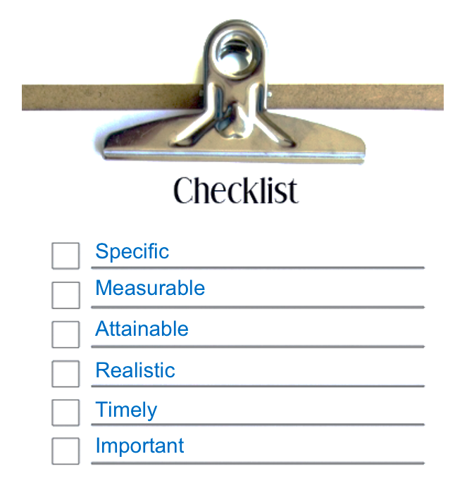
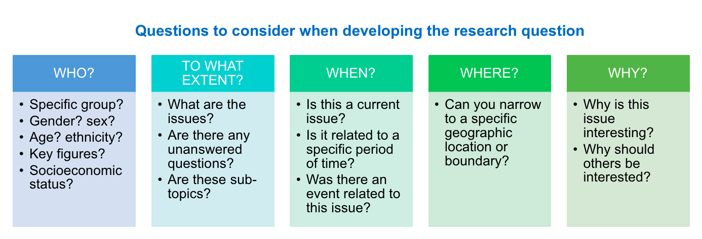
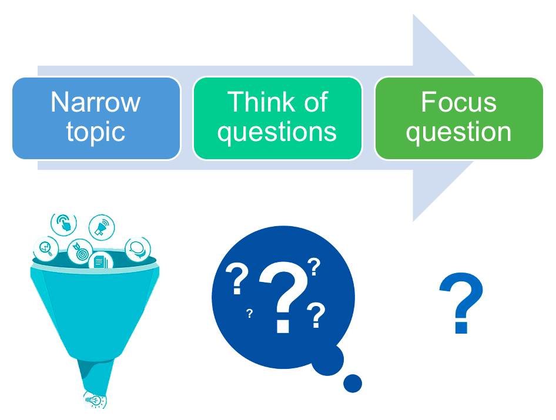

# Developing a research question

With the problem statement and intervention somewhat defined, you should be able to combine these two into a clearly articulated research statement, best depicted in the figure below.

Landing on the right research question might seem trivial given that you have a problem statement, but it is essential to properly guide your experiment. You will use it both during the development stage and constantly revisit it, particularly in the results stage of the experiment cycle.
You’ll want to spend a lot of time on this process, expecting a lot of back-and-forth, with multiple versions and revisions – this is all quite normal. This needs to be clearly articulated before you can move on to technical design choices.
Each of the design choices depend on these crucial first steps – so don’t rush these! You will be better off if you don’t underestimate the preparatory phases leading to the experiment being conducted.

The characteristics of a good research question, assessed in the context of an intended experimental design, are that it be feasible, interesting, novel, ethical, and relevant. A good research question is often focused on a single topic or on several closely related ideas. If it isn't, you won't end up with a good design. If a question is too general or doesn't stay on one topic, you can fix it by deciding which part of the topic you want to research.

For example, insurance companies usually struggle with honesty issues in their clients. In the case of car insurance, there is often a financial incentive to report less miles driven since reporting more would mean you would pay more (i.e. a higher number implies more honesty). The research question in this case was how the team can implement ways to prime honesty in the client group. The researchers sought to prime honesty by asking people to sign at the start of a form rather than the end when reporting how many miles they had driven on their car for insurance purposes. 
The rest relates to experimental design and in fact the results indicated that the treatment (those who got the form with signature at the beginning) to be effective at inducing more honest declarations (Shu et al. (2012), Signing at the beginning makes ethics salient and decreases dishonest self-reports in comparison to signing at the end, PNAS vol. 109).

> A good research topic is broad enough to allow you to find plenty of material, but narrow enough to fit within the size and time constraints of your experiment

## The SMART strategy
The main elements of a good research question are listed below:
- Specific: Not a “fishing expedition”, a good question is usually crisp and concise.
- Measurable: Testable (statistically) and purpuseful. It also means you have the expertise, equipment, and resources to tackle it.
- Attainable: Something that “you” can do, a good question is relevant.
- Realistic: Based on some sort of rationale and logic and can be done in a reasonable time frame.
- Timely: It is novel and prefarably based in new technologies but has a past, and is important to current concerns (has a present). It can lead to new directions – i.e. is not an endpoint in itself (has a future).
- Important: Meaningful whether the answer is “Yes” or “No.”

Some examples of research questions include:   
- An investigation looking at whether stress levels influence how often students engage in academic cheating.   
- A study looking at how caffeine consumption impacts the brain.   
- A study assessing whether men or women are more likely to be diagnosed with depression.  

As observed above, research question differs from the problem statement in that its question format provides guidance. It defines a limited scope or boudary for the problem statement. It tells us what constitutes an end to the answer. By being open-ended, it gives us guidance for what to do next, i.e. answer it.

In other words, a research question allows us to bite off a section of the problem statement that is big enough to chew and swallow it. It directs our attention to a manageable, defined, and bounded problem and then tells us what constitutes a complete response. 
As you continue researching, narrowing your broad question into a more refined question by fine-tuning your question with one (or more) of the following question stems: Who? To What Extent? When? Where? and why?

## The five W's

Good research questions usually do not have one-sentence or factual answers. Unfortunately, this eliminates many who, what, and when questions. Good empirical research questions are not ones where you could get the answer from a publicly available source like Wikipedia, or by asking one knowledgeable person. Best research often comes from the best questions, this is why it is ok to spend more time to develop a specific meaningful research question that addresses a gap.

## Narrowing the topic
Once you have developed a research question, consider evaluating it to identify what parts are too broad or too narrow and find a way to rephrase the question to get to a single experimentation project.

For example, let's say the research question we developed is: does international law cause countries to change their behaviour? 
This question is mostly viable, however, it is rather broad and the outcome of interest, change in behaviour is a concept. What larger idea does behaviour change represent here? population trends? social responses? legislative change? what type of law are we considering? trade? social? environmental? Answering these questions depends on the theory you have in mind and the argument you have developed for why you expect international law to influence behaviour change and which laws are you considering. In this case then, adding additional context like a geography, behaviour, chronological boundry, or law context can clarify the point of view and make the question more representative.

