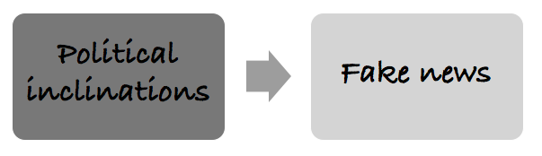
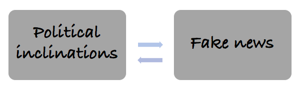

# Case study

For illustration purpose, we are going to use a contentious example. Following the 2016 U.S. presidential election, many have expressed concerns about the effects of false stories, _“fake news,”_ as it has been dubbed, circulated largely through social media on the election results. 

Many have speculated that the exposure to fake news has shaped people’s political inclinations in the presidential election. This group argue that the falsified information delivered in a such dramatic way shifts political inclinations. Others, however, argue that consumption of information is more of a selection process: voters choose their sources of political information on the basis on their existing political preferences. As a result, fake news only reinforces the voters' results but will never change their beliefs. 

## Background research

Your research question is the primary question your project sets out to answer. Or to put it another way, the problem you are trying to solve. Developing the research question is therefore the first step - and one of the most important - in any piece of research. It’s also a task that will come up again and again, because any business research design is cyclical. New questions arise as you iterate and progress through discovering, refining, and improving your products and processes.

Recent evidence shows that: 

(1) 62% of US adults get news on social media (Gottfried and Shearer 2016)
(2) the most popular fake news stories were more widely shared on Facebook than the most popular mainstream news stories (Silverman 2016)
(3) many people who see fake news stories report that they believe them (Silverman and Singer-Vine 2016)
(4) the most discussed fake news stories tended to favor Donald Trump over Hillary Clinton (Silverman 2016)

Putting the above observations together, a number of commentators have suggested that Donald Trump would not have been elected president were it not for the influence of fake news (for examples, see Parkinson 2016; Read 2016; Dewey 2016).

## The problem statement

The terms “research question” and “research problem” are often used interchangeably. Some researchers think in terms of a single research problem and a number of research questions that arise from it. The questions are lines of enquiry to explore in trying to solve the overarching research problem. A research question has two essential roles in setting your research project on a course for success: 1) set the scope and 2) tie the work with to goals and actions.

E.g. Did fake news affect the election result by making it more difficult for voters to infer which electoral candidate they prefer? 

Hypothesis: Fake news is independent of election outcome

## Scenarios

The first step is to observe and identify. This often means asking questions and doing some initial investigation to decide which avenues are worth pursuing further. That could mean talking to cross-functional teams across your business, or going outside your organization for additional expertise and contextual information from the wider industry.

In this example, there are three potential causal relationships.

**1. Fake news affects voting**: Fake news carry certain pieces of information in a way that changes audiences’ preferences.

{width=80%}

**2. Political affiliations determine consumption of news**: People with certain preferences and orientations choose to watch fake news. So, fake news only reinforces but won’t change the existing beliefs.

{width=80%}

**3. Two-way causation**: Political preferences determine which pieces of political information to receive. In turn, it further shapes the existing preferences and changes voters' behaviours. To test these scenario, we can apply a simple experimental design and test it.

{width=80%}

The second step is to review the key factors involved. To do this you have to identify the factors that will affect the research project and begin formulating different methods to control for them. You also need to consider the relationships between factors and the degree of control you have over them. 

## Experimental solution

Once you and your research team have a few observations with promise, prioritize them based on their business impact and importance. It may be that you can answer more than one question with a single study, but don’t do it at the risk of losing focus on your overarching research question.

**Stage one**: Recruit and randomly assign participants into treatment and control groups; pre-test.

**Stage two**: Expose the treatment group to fake news; apply placebo to the control group.

**Stage three**: Record the results of the treatment and control groups. Due to the randomization process, we can control for any previous differences between the treatment and control groups. Therefore, any differences between Result 1and Result 2 are attributable to the presence of fake news.

{width=80%}

Share this thought experiment with the team and executives and get feedback from the key experts you have identified to make sure everyone is aligned and has the same understanding of the research question and the actions you hope to take based on the results. Now is also a good time to demonstrate the return-on-investment of your research and lay out its potential benefits to your stakeholders. Different groups may have different goals and perspectives on the issue. This step is vital for getting the necessary buy-in and pushing the project forward.

