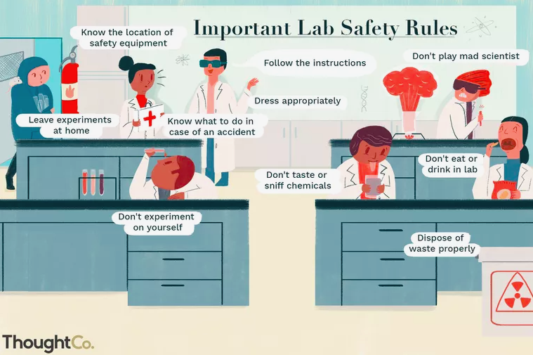

# Preface {-}

Welcome to the first edition of initiating an experiment in the public service. I’m so excited to work on this chapter for the experimentation course and work with my vibrant colleagues in the EW2 cohort.

This  is a repository to house course materials related to module 2 of Government of Canada's Experimentation Course: _Initiating an Experiment: what do you need to consider before starting an experimental project?_

I hope this resource will be useful in clarifying **when** to experiment, **which** experiments are useful and **why**, **what** pitfals to consider, as well as simplifying scientific and technological jargon and common misperceptions. As innovators seeking social good, we have a duty to put our ideas to tests of assessments and evaluations to discover what doesn’t work, what does, and find out how to improve people’s lives.

I am tremendously grateful for the mentorship I have received from the EW2 leading team (Pierre-Olivier Bedard, Dan Monafu, and Sarah Chan) as well as the graphical design work lead by Jordana Globerman.

I will appreciate to know how this course can be improved and what additional topics can be added. I also love to hear how public servants foresee using the experimentation concepts in their projects towards evidence-based transformation of policies, programs, and services. 

A big thanks to Preet Chauhan, EW2 expert, for proof-reading and helping with the many examples.

## Prerequisites / Assumptions

This course is intended for anyone with a curiosity and interest in making scientific observations through experimentation, and does not require previous experience of studying the subject.

An interest in experimentation, willingness to experiment, and an appetite for informed consummation of evidence. It means admitting that we don’t know all the answers but we can put our ideas to test. 

Experimentation necessitates a mature attitude from leaders and decision-makers, one that is willing to experiment and learn positively from “good failure” rather than pretending we have all the answers.

A team of knowledgeable partners with expertise in experimentations methodologies with a transparent and  “open-by-default” approach. 

## Themes

We will explore the following themes in this module to help us answer the question of what we need to consider before starting an experiment: (1) opportunities to experiment in government, and (2) identifying problems and devising hypotheses as part of existing programs/services.

## Recap of Module 1
- Experimentation is about finding what does and does not work in order to inform decisions.
- Experimentation can be considered a de-risking strategy – it can be implemented at a small scale to determine impact early on before (costly) scaling.
- Experimentation is part of a learning process where robust and relevant evidence is gathered in order to inform course corrections, if needed.
- Experimentation is advantageous over other approaches because it deals more effectively with questions of a causal nature (does X have an impact on Y).

## Learning objectives

By the end of this module, you will be able to:

- Identify the steps needed before starting an experimental project
- Devise a problem statement for an experimental project 
- Develop a research question 
- Share the project with stakeholders and get buy-in
- Apply experimentation knowledge to initiate an experiment (example)

## Outline

| Chapter | Title | 
|---------|---------|
| 1 | Deciding to experiment | 
| 2 | Experiment components |
| 3 | Defining the problem |
| 4 | Developing a research question |
| 5 | Mechanics of endorsement | 
| 6 | Examples of Experimentation | 
| 7 | References | 
 

