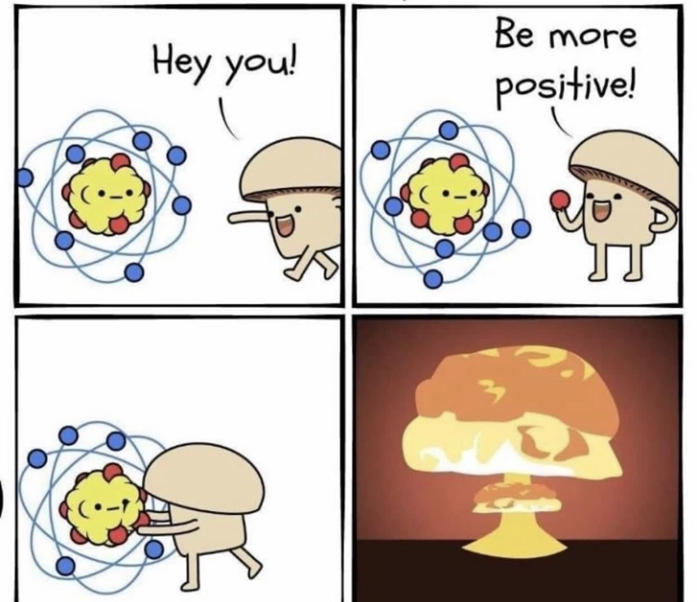

# Before starting an experiment

## Do we need to experiment? 

To embark on an `experimentation project`, we really need to consider whether an _experimentation_ is needed in the first place. One way of determining this is to consider whether out of the many questions that a team has come up with, are there any that require a specific answer to a very specific question? And is the answer worthy to know? If we are after questions that are not causal in nature, then an experiment is likely not the best fit.

At this point in the **experimentation cycle**, there are more questions than answers and the more questions one asks, the more clarifying answers one will seek on whether an experiment is really needed. 

_What would experimentation look like in policy or practice? why would an experiment be worth investing in? what data or program performance tracking is already in place? what experimental tools are available and whether and when they might fall short? what are the risks? What could be a risk management strategy?_

**Decision tree** 

To help make whether an experiment is needed and set one's direction, the following decision tree from Nesta is a great starting point for a project journey.

<center>

</center>


## The experimentation cycle

> A problem well-stated is half-solved!

To help others understand the problem as we see it, the question needs to be well framed and the goals clearly articulated. To help formulating the `why` as well as the `what`, the following experimentation lifecycle is helpful in that it encourages to reiteratively (1) brainstorm and form vague ideas, (2) group vague ideas, (3) make general obervations, (4) hypothesize, (5) determine a model/method to test the hypotheses, (6) do the experiment, (7) gather data, analyze, and interpret the results, and (8) communicate them to stakeholders


<center>
{width=80%}
</center>

This lifecycle presumes that we can:

- sketch out what information we need to collect (or already have) to get from a vague idea to the hypothesis stage for a planned project

- get invested in the problem before the solution nor in a particular result (any biases will work against us here)

- not get stuck in a fishing expedition (i.e. grouping ideas forever)

- understand the problem well enough to crisply articulate the goals, questions, and hypotheses before building metrics.

- select metrics that will help answer the questions. This can include system parameters, workload parameters, behaviours, etc. `“If all you have is a hammer, everything looks like a nail.” - Bernard Baruch`

- identify parameters that affect behaviour or observations and decide which parameters or interactions to study, or vary.

## What can go wrong?

> Don’t land your plane in forests, and don’t do experimental designs before you have considered its drawbacks

Every positive side comes with a negative one, and so no design is really perfect. However, we should choose the designs that best answers the research questions, and don’t try to tailor the research question to the method at hand. 

<center>
{width=80%}
</center>

Experiments can be dangerous if you fall into the following pitfalls:

- Wrong metrics (i.e. they don't answer the question at hand)
- Not clear about `scope` (i.e. what are the boundaries for the 'system under test')
- Unrepresentative metrics or having no comparison groups
- Overlooking significant parameters that affect the behaviour of a system

## Communication of intent

Given that we are considering the option to experiment, we need to have clear and open communications and collaborations with cross-functional teams. 

The aim is to get feedback from as many diverse people as possible. These conversations can not only help us decide which ideas to take forward, but also reiterate clear questions based on feedbacks, and eventually implement in an experimentation proposal. 

These conversations presumes that there is already an executive level buy-in in place and that stakeholders are invested in the experimentation process. This also assumes that a clear and thoughtful design and implementation plan exists before starting to communicate such that it can be communicated wholly and incrementally with the executives. This is not a tautology and hopefully drive the point that iteration, re-iteration, agility, and an open attitude are key qualities in the initial process.

Executive buy-in usually requires a thorough risk assessment and contingency plans more so in the public service space than in academic environments. Therefore, it is important that the executive is aware of the experimentation cycle which can also be thought of as the problem-solving process and endorses the method, approach, tests, and tools that generate evidence. Some, in fact, argue that experimentation is the creation of something new in the face of uncertainty and risk.

> It is noteworthy that the word “experimental” has come to mean “innovative” or “radical” rather than simply “untested”. Genuine experimentation is about committing to rigorous assessments and evaluation  of evidence, not just freewheeling “trying stuff out” or doing things differently and expecting to  succeed.

Therefore, even though a methodology is key to answering a specific question, the starting point is having a problem you are trying to resolve, preferrably with the social good in mind. The purpose of experimenting is to test key questions and assumptions using quick, low risk experiments. 

From the thousands of experiments conducted by Thomas Edison to create the first lightbulb, or the long-running field experiments by Gregor Mendel to examine genetic variability that today underpins modern agriculture concepts, through to trials in medicine,  carefully testing ideas in practice is a cornerstone of scientific and technological discovery.


## Experiments in the public sphere

Today, experiments are critical to sectors where innovation and optimisation are routine, such as web development, digital transformation, electrical vehicles, etc. This has caught on in business such that the largest financial institutions, retailers and restaurants are also running randomized experiments, along with companies like Google, Facebook, and Amazon running tens of thousands of experiments a year. A/B testing is now the standard means through which Silicon Valley improves its online products. However, in government experimentation remains relatively rare and a new field. 

A small but growing movement of policy experimenters are bringing fresh ideas on how to solve public problems. From crafting better services, to making the back-office of government more efficient, new methods and tools need to be used to develop and test policy. In fact, government must rigorously and systematically put policy to the test – or risk stagnation.

```
In the context of government agencies, experiments aim to evaluate a program, policy, 
or service and test an idea or innovation by investigating what difference it has 
made or will make for the people it is aiming to help. 

```

Like laboratory experiments, public sphere experiments also need a control group to test an innovation against “business-as-usual”. This doesn’t have to be a large trial like testing a drug and can be fast and flexible. In fact, the best experiments start small and as a prototype before they are extended. 

For example, the World Bank advocates for “nimble randomized control trials”. They funded nimble evaluations on how best to improve the take up of health insurance in Azerbaijan, expand the use of contraceptives in Burundi, and support teachers to deliver tailored education to children affected by war and displacement in Lebanon.


##  Summary: deciding to experiment
- Do you need to experiment? Why or why not?
- Find a behaviour, program, policy, or service to test 
- Try out of the box thinking to brainstorm
- Think small and short term
- Keep it simple
- Start with a proof-of-concept question and hypothesis
- Have control and treatment groups 
- Measure everything that matters
- Look for natural experiments
