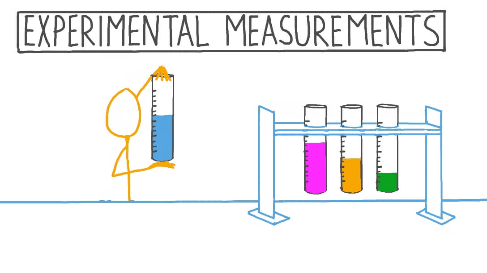

# Experiment components

## The problem statement
>  Experimentation as a problem-solving process carried out under controlled conditions in order to discover an unknown effect or law, to test or establish a hypothesis, or to illustrate a known law

Experimentation is described as many things: a method, an approach, a test, or a tool to generate evidence. All of this is true, but experimentation is first and foremost a problem-solving process. 

The starting point for your experiment should not be the methodology, nor a predetermined answer; it should be the problem you are trying to resolve. 

To help us chose the problem statement, we can go through the following steps:

**Step 1: Choose a topic**
1. What do I find interesting about the subject? 
2. What is known about the subject? 
3. What is missing and what are the gaps?

In theory, the topic could be in any field (for instance, agriculture, but also fiscal policy) and at any level (for instance, it could affect 20 people, or it could reach most of Canada’s population). It could touch upon the realm of policy, program, service delivery, regulatory and internal services. 

The problem doesn’t always need to be causal in nature, in which case perhaps an observational study is better.

**Step 2: Narrow the topic**
1. What do you need to know more about on the topic? 
2. Are you interested in social, political, economic, gender, religious issues related to your topic? (General example) - Find a "slant" on your topic
3. Will the results reveal something new or unexpected?
4. What is in scope and what is out of scope?
5. Can you clearly define hypotheses (If…then…) and explicitly state research questions?

The problem statement you develop should be clear and precise, but also scoped into a relevant policy area that is within your reach (in terms of jurisdiction, for instance). A problem that has too little impact to be deemed important is likely not a great fit, nor is a problem with little decision-making implications very useful to be explored. Similarly,  problem statements that are too vague need to be modified so that they’re scoped appropriately. 

**Step 3: Find Resources**
1. How do we design a research proposal that builds on existing knowledge to address critical questions? 
2. The key here is getting to know what is already done on the topic and how can our design improve or build on current knowledge. 
3. Perform a systematic literature search by using the keywords you have compiled and use them to search for books in Library Catalogs, blogs, or articles in online databases 
4. Consult with experts and seek feedback 

In a government context, the right scale and scope of the experiment will be dictated by what decision-makers need to know coupled with the various practical constraints that inevitably come along through the design process. 

**Step 4: Seek collaboration**
1. Make sure the question is one that other people can get behind and support
2. Establish collaboration agreements and executive buy-in
3. Peer-review for clarity, scientific accuracy, and feasibility
4. Does the team have the expertise required to complete the project? If not, who else needs to be on team

Figuring out the problem will take time, and needs to be done in consultation with as many parties directly or indirectly potentially impacted by the experiment’s results. Before starting the problem definition stage, you should take time to discuss alongside colleagues, management and others (experts and practitioners, current users) what exactly you wish you fix.

## Determine interventions

It’s important to be clear what different experimental designs can and can’t tell us. What sets observational studies apart from experimental studies is that there is a component of **intervention** in experimentation. 

Only certain experimental designs are helpful for learning about impact and effectiveness of an intervention, and for finding out whether or not our new idea is really making a difference. This approximates the controlled experiment of basic science.

Therefore, when setting up an experimental design, we need to think about what the intervention/ treatment groups might look like in our program/ operation. It is helpful to think of interventions as steps that help us evaluate the direct impacts of treatment or preventive measures on a situation.  

In this case, each experimental study design has specific outcome measures that rely on the type and quality of data utilized. Additionally, experimental studies are usually randomized, meaning the subjects are grouped by chance and we study what happens to people in each group (treatment and control). Any difference in outcomes can then be linked to the intervention.

For instance, a well designed randomised control trial (RCT) provides a strong evidence that a given intervention can postulate effectiveness or safety, etc. A RCT is best used when we need to draw conclusions on causality.

## Measuring outcomes

When designing the intervention, it is also important to determine what you want to measure and what the hypothesized effects might be. This will also illuminate what data we need to collect and what techniques we will need to use for analysis. 

An outcome measure, endpoint, effect measure or measure of effect is a measure which is used to assess the effect, both positive and negative, of an intervention or treatment. Measures can often be quantified using effect sizes. They can also be thought of as providing a score, an interpretation of results or at times a risk categorization of study groups. Prior to providing any intervention, an outcome measure provides baseline data on variable.

**Determine outcome measures through visualization of outcomes / prototypes**

As well as increasing our understanding of what experimental design to use when, there is scope for experimenters to get much better at using different tools in combination to innovate more effectively. Prototypers, for instance, could use low-cost randomised trials like A/B tests or nimble trials to evaluate prototyped products or services.

Prototyping emphasises front-loading risk and creating a solution with a better chance of success through stakeholder engagement. Using plastic Lego bricks to build prototypes of engineering products is a low-fi, low-resource way of making early operational or design issues obvious. But it won’t tell you whether or not the new system works in real life, or at scale.

Considerations when designing prototypes is to implement an intervention and measure the outcomes and impacts. For this, we need an independent variable or the factor that is manipulated, changed, or intervened and is usually a variable that is placed on x-axis when grouping. The other is a dependent variable or the factor that is being measured and usually placed on y-axis during grouping and visualization. 

## Experimental design

Next is to determine if randomization is possible, what the sampling unit and approach might be, how the control group might be set up as well as how many observations are needed based on power calculations.

Randomised experiments, or quasi-experimental designs, sometimes couched in deadly technical language, are uniquely valuable. Despite their unfashionable status among some policy wonks and evaluators, we will also highlight the value and utility of Quasi-Experimental designs in the next module. 

Other approaches may be also be suited to finding out different things, at different stages of developing a policy solution.

- A control group is a group of ‘test’ items in an experiment. The control group will be used to compare with the experimental group
- The control group doesn’t get the treatment 
- An experimental group is the group(s) of test items where only one change (called the experimental or independent variable) has been made
- The experimental group gets the treatment
- The experimental group may have dependent or independent variables

In the case when a real control group is not available, a synthetic control group or a more inventive statistical methods may be useful.

**Sample size consideration**
- Maximize sample size: the larger the number of test items the more accurate the estimate
- Use representative groups: the samples must reflect the natural variation in the population. Use random or systematic sampling to reduce inherent bias in data.

### Identify sources of error
- Mind the constants: the conditions that are kept the same for control and experimental groups
- Not controlling for factors or parameters that are kept the same in both control and experimental groups can result in error

## Data analysis
Analyze data to test the effects of the intervention (for instance, by comparing the differences across groups using control variables, when necessary).
Step 6: Report back and adapt - present the results and disseminate the evidence to identity key learnings, then adapt your program / operation based on what the evidence dictates.
