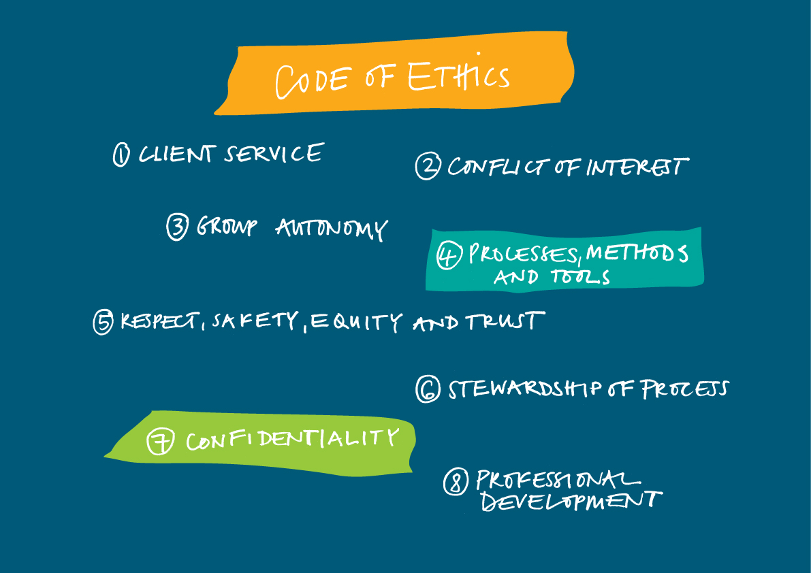

# Mechanics of endorsement

## Project timelines and milestones

## Communication matrix 

- stakeholder consensus

requirements
- Use communication matrix to relay information to stakeholders/executive
- Importance: Why do we need to answer this scientific question now?
- Novelty: Has this question been answered? Has it been attempted?
- Impact: What’s the risk, and what's the potential upside?
- Design: Is the design of the experiment sound? how?
- Qualifications: What makes this researcher/research uniquely qualified?

Communication of experimentation processes is like an onion, we can start in the middle layer with peers and colleagues and close supporters who can understand the message. From there, your secondary networks help build momentum. Once it's clear your science resonates with people, then you can reach a larger audience through press and media. Read our = link_to "Researcher Guide ", guide_path for more info on the basics of crowdfunding.

- Establish a communication matrix
- Experiment status project updates to whom and how
- Foster a culture of experimentation in the organization
 Explain the business value of experimentation to decision-makers
- Establish accountabilities 
- Frequency and content of communications
- Structural report updates

## Collaboration agreements 

- team support 

## Funding models and budget targets

## Code of conduct

There are opportunities to experiment even on difficult social issues such as interventions in poverty policies, drug use, or healthy-living interventions. Creating a control group can carry its own risk. If, for example, we are experimenting with a new benefits scheme, having a control group allows us to test whether the scheme has actually achieved its goals, but it also means depriving a group of citizens of an improved service, at least initially. 

To get around this, a phased policy roll-out can create what’s called a “waiting list” experiment where the control group are the soon-to-have-innovation group. Everybody eventually receives the new policy innovation, negating the risk of push-back from the public. This approach was used by the UK’s Ministry of Housing, Communities and Local Government in their first ever randomized trial on community integration. In 2016, they tested whether English language training could help immigrants engage more in their community.

The results were impressive. They found significant improvements on many social integration outcomes, such as new friendships formed with people from other cultures, and attending more health appointments. The trial helped the Department put together new plans for their 2018 Integrated Communities Green Paper — including a network of conversation clubs and a new English language fund. For others wanting to design their own experiments in the UK Government, there is a Trials Advice Panel run by the Cabinet Office What Works Team who can walk you through the technicalities.

Ethical considerations:
- Information sharing agreements and memorandums of understanding
- Identify situations where experimentations are appropriate and relevant
- Check Institutional Review Board (IRB) approval requirements prior to the launch of the experiment
- Perform privacy impact assessments
- Get ethics committee approvals

In summary:  
- Be ethical!
- Inform users
- Clear consent of participation

## Executive support

Once an experimentation plan has been devised, you will need to make a good case as to why the strategy deserves a dedicated budget and resources and what sets this apart from other program initiatives already in place. 

So how do you do it? Below are 3 steps to help in making a convincing case to obtain executive buy-in for your proposal. 

1. Figure out who you should be talking to, that is, identify the relevant stakeholders in your organization who have the authority to sign off on a new strategy, allocate budget resources and designate personnel. You can make a list of the people you want to target. Next, you can ask what business needs do they face and what problems does the organization have that an experimentation can solve? Think like a marketer present your plan as a solution to those specific problems. It is also helpful to find a personal advocate within the organization to function as a change agent—someone who believes in you and has enough clout to advocate on your behalf. This will help give your experimental plan some authority when you present it to the executives.

2. Show your accomplishments and what the experimentation can do. This precludes getting to know your organization's analytics capacity and correlating your experimentation success with the real results already existing. For instance, you can communicate that “you have been doing X, and it's been contributing to Y”. Evidence-based plans are a powerful formula for getting executive buy-in.  What if your community is relatively new, or not yet in existence? If this the case, you can benefit from the experience of others and researching a cache of other success stories ready to be applied to your programs. The question the executives will want to know is, how will you make another's success your own success. This requires an experimentation plan.

3. Lay out the experimentation's strategic plan for success. Once you have identified key stakeholders and worked on a compelling vision of how you can solve a key problem, you can start sharing that strategic plan. Your plan should, at a minimum, answer the following questions:

- What specific actions must you take to build a community for your research plan?
- What resources do you need to take those actions?
- What results—concrete and abstract—do you hope to achieve?
- What are the risks? how are the risks managed?
- How will you measure your results against your actions?
- How will you quantify the value of this process?
- Are your expectations realistic? Prove it.
- What are your performance deadlines?

