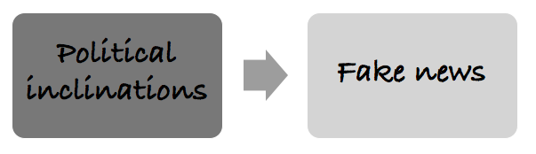
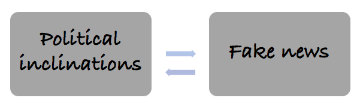

# Case study

For illustration purpose, we are going to use a contentious example. Following the 2016 U.S. presidential election, many have expressed concerns about the effects of false stories, _“fake news,”_ as it has been dubbed, circulated largely through social media on the election results. 

Many have speculated that the exposure to fake news has shaped people’s political inclinations in the presidential election. This group argue that the falsified information delivered in a such dramatic way shifts political inclinations. Others, however, argue that consumption of information is more of a selection process: voters choose their sources of political information on the basis on their existing political preferences. As a result, fake news only reinforces the voters' results but will never change their beliefs. 

## Background research

Recent evidence shows that: 

(1) 62% of US adults get news on social media (Gottfried and Shearer 2016)
(2) the most popular fake news stories were more widely shared on Facebook than the most popular mainstream news stories (Silverman 2016)
(3) many people who see fake news stories report that they believe them (Silverman and Singer-Vine 2016)
(4) the most discussed fake news stories tended to favor Donald Trump over Hillary Clinton (Silverman 2016)

Putting the above observations together, a number of commentators have suggested that Donald Trump would not have been elected president were it not for the influence of fake news (for examples, see Parkinson 2016; Read 2016; Dewey 2016).

## The problem statement

Did fake news affect the election result by making it more difficult for voters to infer which electoral
candidate they prefer? 

Hypothesis: Fake news is independent of election outcome

## Scenarios

In this example, there are three potential causal relationships.

**1. Fake news affects voting**: Fake news carry certain pieces of information in a way that changes audiences’ preferences.

{width=80%}

**2. Political affiliations determine consumption of news**: People with certain preferences and orientations choose to watch fake news. So, fake news only reinforces but won’t change the existing beliefs.

{width=80%}

**3. Two-way causation**: Political preferences determine which pieces of political information to receive. In turn, it further shapes the existing preferences and changes voters' behaviours. To test these scenario, we can apply a simple experimental design and test it.

{width=80%}

## Experimental solution

**Stage one**: Recruit and randomly assign participants into treatment and control groups; pre-test.

**Stage two**: Expose the treatment group to fake news; apply placebo to the control group.

**Stage three**: Record the results of the treatment and control groups. Due to the randomization process, we can control for any previous differences between the treatment and control groups. Therefore, any differences between Result 1and Result 2 are attributable to the presence of fake news.

{width=80%}

